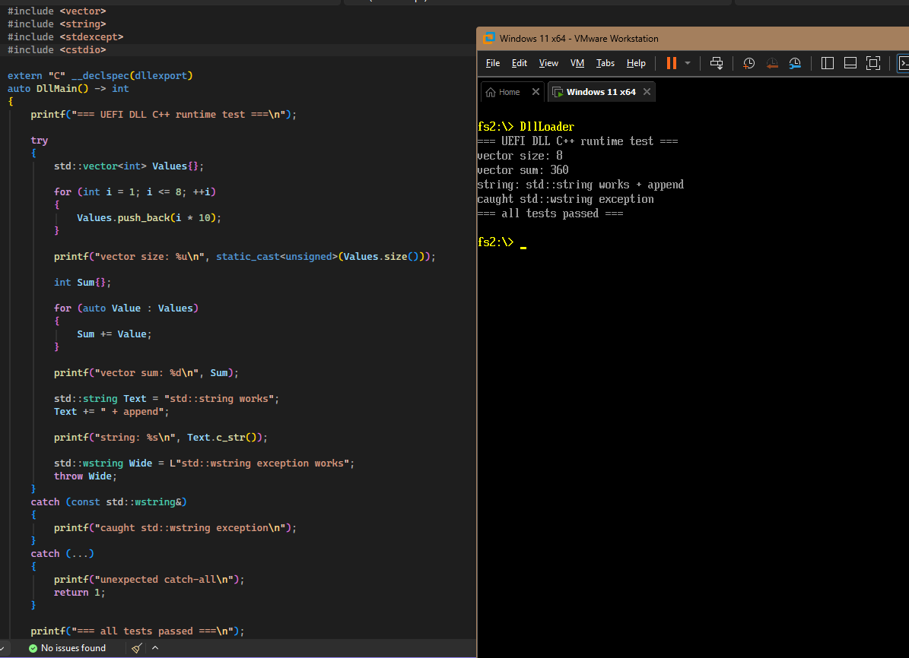

# DllLoader

A modern C++ PE/DLL loader and runtime environment for UEFI.

DllLoader provides manual PE image mapping, relocation processing, import resolution, CRT support, C++ runtime support, exception handling, and STL support for dynamically loaded DLLs running inside UEFI.

The project allows DLLs to use modern C++ features without relying on the Windows loader or operating system services.

---

## Features

### PE Loader

* Manual PE image mapping
* Section mapping
* Base relocations
* Import resolution
* Export resolution
* Dynamic symbol registration
* Runtime event system
* Host-provided imports

### Runtime Environment

* Custom host runtime
* CRT support
* MSVC C++ runtime support
* Exception handling support
* STL support
* Host context access
* Runtime diagnostics and tracing

---

## Supported Runtime Features

### CRT

* malloc / free
* calloc / realloc
* memcpy / memmove / memset / memcmp
* strlen / wcslen
* strcmp / strncmp
* wcscmp / wcsncmp
* strcpy / strncpy
* wcscpy / wcsncpy
* putchar
* puts
* printf
* vfprintf

### C++

* operator new / delete
* operator new[] / delete[]
* std::nothrow new
* sized delete
* RTTI support
* type_info support

### Exception Handling

* throw / catch
* catch(...)
* catch by value
* catch by reference
* nested exceptions
* rethrow (`throw;`)
* multiple inheritance catch adjustment
* MSVC exception metadata decoding
* Custom `_CxxThrowException`
* Custom exception dispatching
* Custom catch continuation trampoline

### STL

Validated functionality includes:

* std::string
* std::wstring
* std::vector
* std::unique_ptr
* std::shared_ptr
* std::weak_ptr
* std::optional
* std::variant
* std::any
* std::function
* std::array
* std::pair
* std::tuple
* std::deque
* std::list
* std::set
* std::unordered_set
* std::map
* std::unordered_map
* std::sort

---

## Host Runtime

Loaded DLLs can access the UEFI environment through the host runtime.

```cpp
auto* Host = GetHostContext();

Host->SystemTable;
Host->BootServices;
Host->RuntimeServices;
```

This allows DLLs to interact with UEFI services without directly linking against UEFI libraries.

---

## Runtime Events

The runtime exposes diagnostic events which can be used to monitor loader and runtime activity.

```cpp
Dll::Runtime::OnFuncCall.Subscribe(
[](StringView FunctionName)
{
    Stream::Out::Serial
        << "[DLL Runtime] "
        << FunctionName
        << Stream::Endl;
});

Dll::Runtime::OnUnhandledCall.Subscribe(
[](const Dll::Runtime::UnhandledCallInfo& Info)
{
    Stream::Out::Serial
        << "[DLL Runtime][Unhandled] "
        << Info.FunctionName
        << ": "
        << Info.Reason
        << Stream::Endl;
});
```

The loader also exposes events for image loading, import resolution, failures, and unload operations.

---

## Example DLL

```cpp
extern "C" __declspec(dllexport)
auto DllMain() -> int
{
    printf("=== UEFI DLL C++ runtime test ===\n");

    try
    {
        std::vector<int> Values{};

        for (int i = 1; i <= 8; ++i)
        {
            Values.push_back(i * 10);
        }

        printf("vector size: %u\n", static_cast<unsigned>(Values.size()));

        int Sum{};

        for (auto Value : Values)
        {
            Sum += Value;
        }

        printf("vector sum: %d\n", Sum);

        std::string Text = "std::string works";
        Text += " + append";

        printf("string: %s\n", Text.c_str());

        std::wstring Wide = L"std::wstring exception works";
        throw Wide;
    }
    catch (const std::wstring&)
    {
        printf("caught std::wstring exception\n");
    }
    catch (...)
    {
        printf("unexpected catch-all\n");
        return 1;
    }

    printf("=== all tests passed ===\n");
    return 0;
}
```

---

## Validation

The runtime has been validated with:

* Dynamic allocation
* STL containers
* STL algorithms
* Smart pointers
* RTTI
* Exception handling
* Nested exceptions
* Exception rethrow
* Multiple inheritance exception adjustment
* Formatted console output

Example validation tests can be found in:

```text
UefiDll/DllMain.cpp
```

---

## Showcase

[](https://www.youtube.com/watch?v=nBW1Z3q9wao)


---

## Status

This project is actively developed and serves as an experimental modern C++ runtime environment for UEFI with support for dynamically loaded PE images and a growing subset of the MSVC CRT and STL.